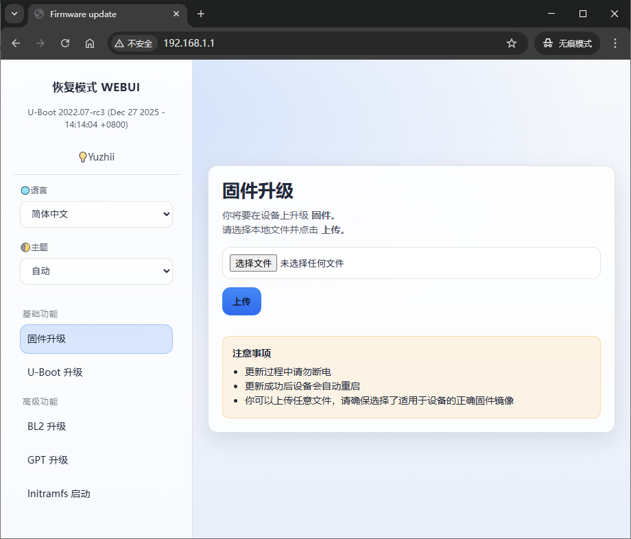
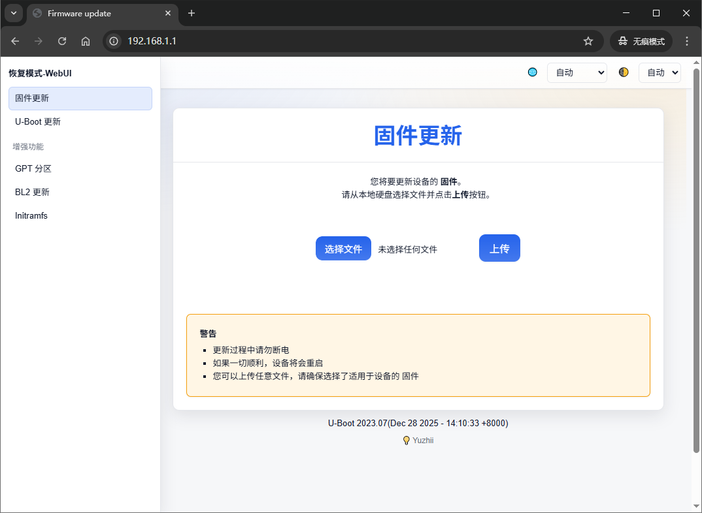
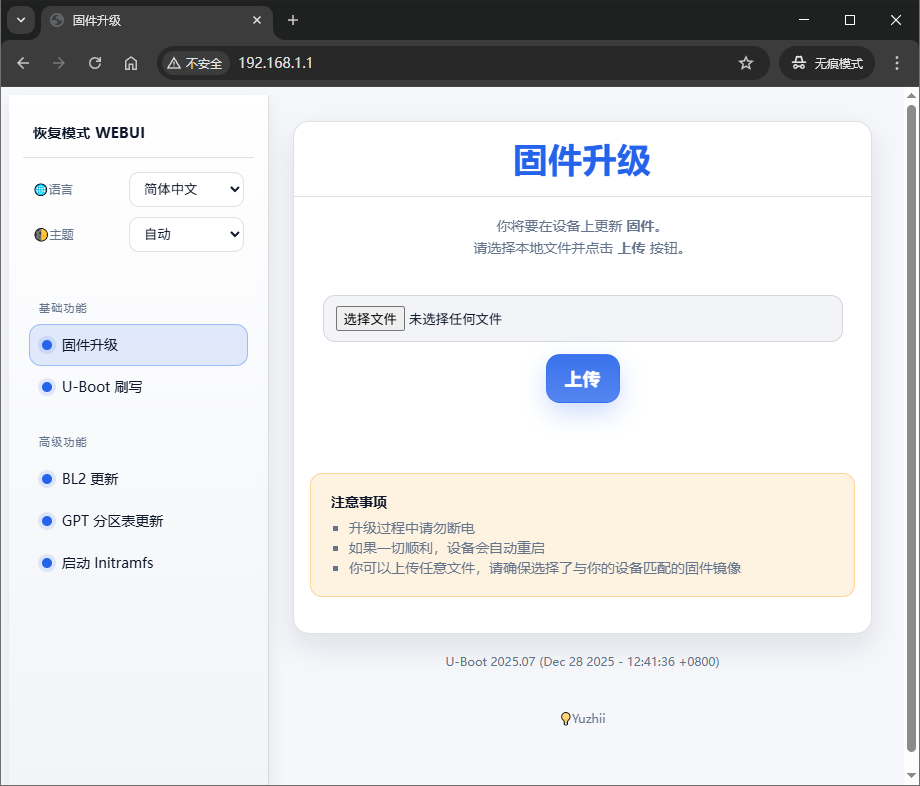

# ATF and u-boot for mt798x

A modified version of hanwckf's u-boot for mt798x by Yuzhii, with support for auto dhcp, and beautiful webui.(build with version 2022/2023/2024/2025)

Support Actions to build automatically, generate normal/overclocking BL2. 

## About bl-mt798x

- https://cmi.hanwckf.top/p/mt798x-uboot-usage

> Version-2022 WEBUI preview



> Version-2023/2024 WEBUI preview



> Version-2025 WEBUI preview



## Prepare

```bash
sudo apt install gcc-aarch64-linux-gnu build-essential flex bison libssl-dev device-tree-compiler qemu-user-static
```

## Build

```bash
chmod +x build.sh
SOC=mt7981 BOARD=360t7 VERSION=2022 ./build.sh
SOC=mt7981 BOARD=cmcc_a10 VERSION=2024 MULTI_LAYOUT=1 ./build.sh
```

> SOC=mt7981/mt7986

> VERSION=2022/2023/2024/2025

> MULTI_LAYOUT=1 (Optional, only for multi-layout devices, e.g. xiaomi-wr30u, redmi-ax6000)

> The diffence of every version

| Version | ATF | UBOOT |
| --- | --- | --- |
| 2022 | 20220606-637ba581b | 20220606 |
| 2023 | 20231013-0ea67d76a | 20230718-09eda825 |
| 2024 | 20240117-bacca82a8 | 20230718-09eda825 |
| 2025 | 20250711 | 20250711 |

Generate file will be in `output`

## Generate GPT with python2.7

```bash
chmod +x generate_gpt.sh
./generate_gpt.sh
```

Generate file will be in `output_gpt`

> You need add your device's partition info json file in "atf-20231013-0ea67d76a/tools/dev/gpt_editor/mt798x", like e.g. "philips-hy3000_128G_rootfs1024M_production1024M-gpt.json"

## Use Action to build

- [x] Build FIP
- [ ] Build GPT (Only gpt.json exists)
- [ ] Build BL2 (Normal)
- [ ] Build BL2 (Overclocking)
- [ ] Multi-layout support (Only for multi-layout devices)
- [ ] Special subnet support (Custom default IP for DHCPD)

> Although you can customize the dhcpd subnet, but the mask is fixed to "255.255.255.0", so you must ensure your device is in this subnet.

## FIT support

This function is from 1715173329's [bl-mt798x-oss](https://github.com/1715173329/bl-mt798x-oss/tree/fit-example)

I based on his work to make a patch to support FIT image.

There only supports a limited number of models, If your device is not in the list, you can try to add support by yourself according to his work.

***BUT NOT TESTED YET!***

So, **You MUST test it by yourself, and have risk of BRICK!**

There are two way to build.

1. Apply patch and build Version 2022

    ```bash
    git apply modify-patch/0002-uboot-2022-fit-merge-code-from-1715173329-to-support.patch
    SOC=mt7981 BOARD=your_board VERSION=2022 ./build.sh
    ```

2. Build on Actions

Open the repository Actions tab, and choose "Build FIT BL2 and FIP" workflow, then run it.

---

### xiaomi-wr30u multi-layout uboot firmware compatibility

|Firmware type|uboot (default)|uboot (immortalwrt-112m)|uboot (qwrt)|
|:----:|:----:|:----:|:----:|
|[xiaomi stock mtd8/mtd9](https://github.com/hanwckf/xiaomi-router-stock-ubi-bin/tree/main/xiaomi-wr30u)|√|×|×|
|[immortalwrt-mt798x stock](https://github.com/hanwckf/immortalwrt-mt798x/blob/openwrt-21.02/target/linux/mediatek/files-5.4/arch/arm64/boot/dts/mediatek/mt7981-xiaomi-mi-router-wr30u-stock.dts)|√|×|×|
|[OpenWrt stock](https://github.com/openwrt/openwrt/blob/main/target/linux/mediatek/dts/mt7981b-xiaomi-mi-router-wr30u-stock.dts)|√|×|×|
|[immortalwrt stock](https://github.com/immortalwrt/immortalwrt/blob/master/target/linux/mediatek/dts/mt7981b-xiaomi-mi-router-wr30u-stock.dts)|√|×|×|
|[X-Wrt stock](https://github.com/x-wrt/x-wrt/blob/master/target/linux/mediatek/dts/mt7981b-xiaomi-mi-router-wr30u-stock.dts)|√|×|×|
|[immortalwrt-mt798x 112m](https://github.com/hanwckf/immortalwrt-mt798x/blob/openwrt-21.02/target/linux/mediatek/files-5.4/arch/arm64/boot/dts/mediatek/mt7981-xiaomi-mi-router-wr30u-112m.dts)|×|√|×|
|[GL.iNet by 237176253](https://www.right.com.cn/forum/thread-8297881-1-1.html)|×|√|×|
|[X-Wrt 112m nmbm](https://github.com/x-wrt/x-wrt/blob/master/target/linux/mediatek/dts/mt7981b-xiaomi-mi-router-wr30u-112m-nmbm.dts)|×|√|×|
|[OpenWrt 112m nmbm](https://github.com/openwrt/openwrt/blob/main/target/linux/mediatek/dts/mt7981b-xiaomi-mi-router-wr30u-112m-nmbm.dts)|×|√|×|
|[immortalwrt 112m nmbm](https://github.com/immortalwrt/immortalwrt/blob/master/target/linux/mediatek/dts/mt7981b-xiaomi-mi-router-wr30u-112m-nmbm.dts)|×|√|×|
|[X-Wrt 112m nmbm](https://github.com/x-wrt/x-wrt/blob/master/target/linux/mediatek/dts/mt7981b-xiaomi-mi-router-wr30u-112m-nmbm.dts)|×|√|×|
|[QWRT](https://www.right.com.cn/forum/thread-8284824-1-1.html)|×|×|√|
|[OpenWrt ubootmod](https://github.com/openwrt/openwrt/blob/main/target/linux/mediatek/dts/mt7981b-xiaomi-mi-router-wr30u-ubootmod.dts)|×|×|×|
|[immortalwrt ubootmod](https://github.com/immortalwrt/immortalwrt/blob/master/target/linux/mediatek/dts/mt7981b-xiaomi-mi-router-wr30u-ubootmod.dts)|×|×|×|
|[X-Wrt ubootmod](https://github.com/x-wrt/x-wrt/blob/master/target/linux/mediatek/dts/mt7981b-xiaomi-mi-router-wr30u-ubootmod.dts)|×|×|×|

### redmi-ax6000 multi-layout uboot firmware compatibility

|Firmware type|uboot (default)|uboot (immortalwrt-110m)|
|:----:|:----:|:----:|
|[xiaomi stock mtd8/mtd9](https://github.com/hanwckf/xiaomi-router-stock-ubi-bin/tree/main/redmi-ax6000)|√|×|
|[immortalwrt-mt798x stock](https://github.com/hanwckf/immortalwrt-mt798x/blob/openwrt-21.02/target/linux/mediatek/files-5.4/arch/arm64/boot/dts/mediatek/mt7986a-xiaomi-redmi-router-ax6000-stock.dts)|√|×|
|[OpenWrt stock](https://github.com/openwrt/openwrt/blob/main/target/linux/mediatek/dts/mt7986a-xiaomi-redmi-router-ax6000-stock.dts)|√|×|
|[immortalwrt stock](https://github.com/immortalwrt/immortalwrt/blob/master/target/linux/mediatek/dts/mt7986a-xiaomi-redmi-router-ax6000-stock.dts)|√|×|
|[X-Wrt stock](https://github.com/x-wrt/x-wrt/blob/master/target/linux/mediatek/dts/mt7986a-xiaomi-redmi-router-ax6000-stock.dts)|√|×|
|[immortalwrt-mt798x](https://github.com/hanwckf/immortalwrt-mt798x/blob/openwrt-21.02/target/linux/mediatek/files-5.4/arch/arm64/boot/dts/mediatek/mt7986a-xiaomi-redmi-router-ax6000.dts)|×|√|
|[GL.iNet by 237176253](https://www.right.com.cn/forum/thread-8297881-1-1.html)|×|√|
|[X-Wrt ubootlayout](https://github.com/x-wrt/x-wrt/blob/master/target/linux/mediatek/dts/mt7986a-xiaomi-redmi-router-ax6000-ubootlayout.dts)|×|√|
|[OpenWrt ubootmod](https://github.com/openwrt/openwrt/blob/main/target/linux/mediatek/dts/mt7986a-xiaomi-redmi-router-ax6000-ubootmod.dts)|×|×|
|[immortalwrt ubootmod](https://github.com/immortalwrt/immortalwrt/blob/master/target/linux/mediatek/dts/mt7986a-xiaomi-redmi-router-ax6000-ubootmod.dts)|×|×|
|[X-Wrt ubootmod](https://github.com/x-wrt/x-wrt/blob/master/target/linux/mediatek/dts/mt7986a-xiaomi-redmi-router-ax6000-ubootmod.dts)|×|×|
