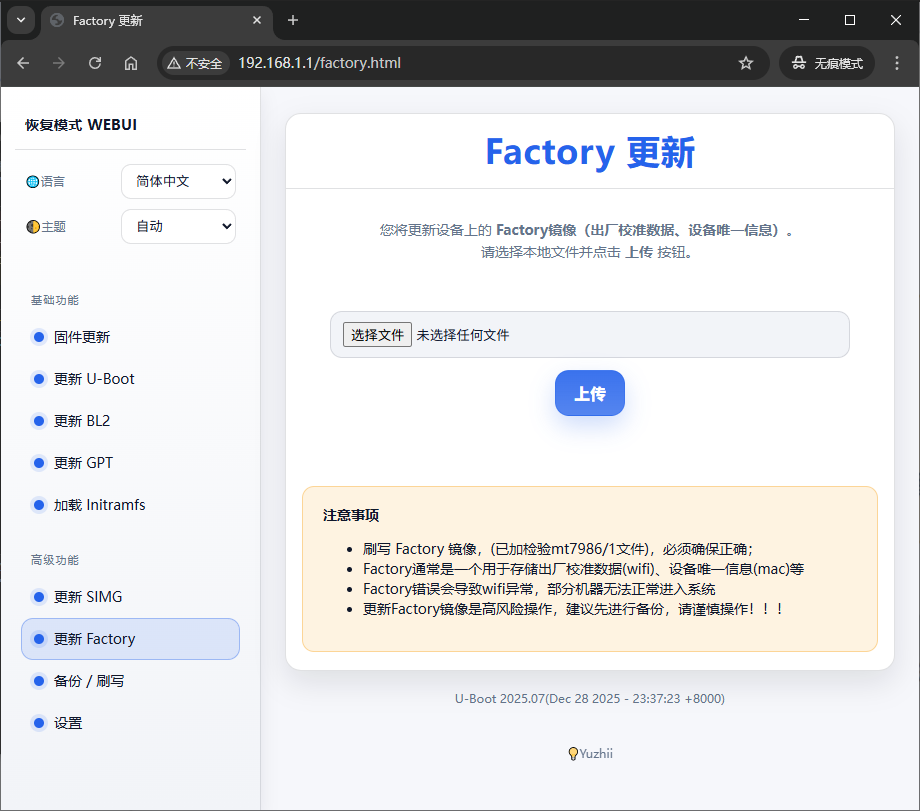

# Failsafe WebUI API 文档（基于当前代码库）

**说明**，因为某些因素，未实现部分的 API、相关代码**不会开源**，本文档仅供内部参考与开发使用。

其次，本文档来自 AI 总结与整理，**并不保证完全准确**，实际开发时请以代码为准。

但是提供已经实现的 API 说明，以及现成 WebUI 网页代码以及 JS 代码中调用的 API 列表，方便补齐未实现的部分。

> 也就是说，本文档描述的“未实现 API”部分，代码并不存在于当前代码库中。有能力自己开发补全。

> 当然，你自己如果做出来了，也可以开源贡献社区。

详细见  [unopen-failsafe-webui.tar.gz](unopen-failsafe-webui.tar.gz)

> Version-2025-unopen WEBUI preview

---

> 范围

本文档基于 `failsafe/failsafe.c`、`failsafe/fsdata/*.html`、`failsafe/fsdata/main.js`、`net/mtk_httpd.c`、`board/mediatek/common/failsafe.c` 的实现现状整理。

> 目标：

1) 列出**已实现** API/路由及其大致流程（前端触发 → 后端处理 → 返回值约定 → 后续动作）。
2) 列出 `main.js`/网页中**已引用但后端未实现**的 API，并说明需要补齐的步骤与注意点。

---

## 1. 总体架构

### 1.1 HTTP 服务器能力与限制（`net/mtk_httpd.c`）

- 支持方法：`GET`、`POST`。
- `POST` 仅接受 `multipart/form-data`（通过 `boundary=` 检测）。
- **表单值数量上限**：`MAX_HTTP_FORM_VALUE_ITEMS = 5`（见 `include/net/mtk_httpd.h`）。
  - 这会影响类似 `/flash_partition` 这种携带多个字段 + 文件上传的接口设计。
- **上传缓冲区**：
  - 默认弱符号 `httpd_get_upload_buffer_ptr()` 返回 `gd->ram_base`。
  - MTK 平台在 `board/mediatek/common/failsafe.c` 覆盖为 `gd->ram_base + 0x6000000`（避开 BL31 地址段）。
- **QueryString 会被丢弃**：
  - `mtk_httpd.c` 在解析 URI 时执行：
    - `p = strchr(uri_ptr, '?'); if (p) *p = 0;`
  - 结论：**后端 handler 看不到 `?a=b` 的参数**。
  - 这会直接影响前端用 `/http_download?partition=...&size=...` 这种方式传参。

### 1.2 升级写入与校验（`failsafe/failsafe.c` + `board/mediatek/common/failsafe.c`）

- `/upload` 只负责：
  1) 接收文件并放入内存（upload buffer），
  2) 设置全局状态（`upload_data/upload_size/fw_type`），
  3) 计算 MD5，
  4) 进行部分类型的 `failsafe_validate_image()` 校验。
- 实际写 Flash/分区发生在 `/result`：
  - `/result` 的 responding 阶段调用 `failsafe_write_image(upload_data, upload_size, fw_type)`。
- `failsafe_write_image()` 的 MTK 实现会根据 `fw_type` 映射到升级分区缩写（`gpt/bl2/fip/fw`），并调用 `board_upgrade_data_parts()` 给出的 `data_part_entry.write()` 去写入。

---

## 2. 已实现（后端已注册）的路由与 API

> 以 `failsafe/failsafe.c:start_web_failsafe()` 注册的 URI 为准。

### 2.1 页面与静态资源

| URI | 方法 | 处理器 | 说明 |
| --- | --- | --- | --- |
| `/` | GET | `index_handler` | 返回 `index.html` |
| `/uboot.html` | GET | `html_handler` | 返回 `uboot.html` |
| `/bl2.html` | GET | `html_handler` | 返回 `bl2.html` |
| `/initramfs.html` | GET | `html_handler` | 返回 `initramfs.html` |
| `/gpt.html` | GET | `html_handler` | **仅在** `CONFIG_MTK_BOOTMENU_MMC` 打开时注册 |
| `/flashing.html` | GET | `html_handler` | 进度页；页面会 AJAX 调用 `/result` |
| `/fail.html` | GET | `html_handler` | 失败页 |
| `/booting.html` | GET | `html_handler` | 启动页（如果存在 fsdata 文件） |
| `/style.css` | GET | `style_handler` | content-type: `text/css` |
| `/main.js` | GET | `js_handler` | content-type: `text/javascript` |
| `""`（空 URI） | GET/POST | `not_found_handler` | 返回 `404.html`，HTTP 404 |

> 注意：当前代码**未注册** `/simg.html`、`/factory.html`、`/backup.html`、`/setting.html`，即使 fsdata 里存在这些文件，默认也会走 404。

### 2.2 `GET /version`

- 前端调用：几乎所有页面 `onload="getversion()"`。
- 后端：`version_handler`。
- 返回：`text/plain`，内容为 `version_string`。

### 2.3 `POST /upload`

- 前端调用：`main.js` 的 `upload(fieldName)`。
- 请求：`multipart/form-data`，表单字段名取决于页面：
  - 固件：`firmware`
  - U-Boot：`fip`
  - BL2：`bl2`
  - initramfs：`initramfs`
  - GPT：`gpt`（仅在 `CONFIG_MTK_BOOTMENU_MMC` 场景有效）
  - （注意：当前后端**不支持** `simg`、`factory` 等字段名，会返回 `fail`）
- 可选字段：
  - `mtd_layout`：仅固件 `firmware` 上传时会读取（`CONFIG_MEDIATEK_MULTI_MTD_LAYOUT`）。

#### 返回格式

- 失败：返回字符串 `fail`
- 成功：返回一行字符串（以空格分隔）
  - 无多布局：`<size> <md5>`
  - 有多布局且携带 `mtd_layout`：`<size> <md5> <mtd_layout>`

#### 后端处理流程（/upload，简化）

1) 在表单中按顺序查找：`gpt` → `fip` → `bl2` → `firmware` → `initramfs`
2) 根据命中字段设置 `fw_type`：
   - `FW_TYPE_GPT / FW_TYPE_FIP / FW_TYPE_BL2 / FW_TYPE_FW / FW_TYPE_INITRD`
3) 针对部分类型做校验：
   - `fip/bl2/firmware` 调用 `failsafe_validate_image()`
   - `initramfs` 检查 `fdt_check_header()`
4) 保存全局上传状态：`upload_data_id/upload_data/upload_size`
5) 计算 MD5，拼接返回字符串。

### 2.4 `GET /result`

- 前端调用：`flashing.html` 中 `ajax({ url: '/result' ... })`
- 后端：`result_handler`
- 返回：正文为 `success` 或 `failed`（注意：不是 JSON）

#### 后端处理流程（/result，简化）

1) `HTTP_CB_NEW`：创建 session 状态，先返回 HTTP 头（custom response）。
2) `HTTP_CB_RESPONDING`：
   - 如果 `upload_data_id == upload_id` 说明有新上传数据：
     - 若是 `FW_TYPE_INITRD`：仅标记成功（`st->ret = 0`）
     - 否则：调用 `failsafe_write_image(upload_data, upload_size, fw_type)` 写入
   - 将 `upload_data_id` 置为随机值，避免重复写入
   - 返回正文 `success` 或 `failed`
3) `HTTP_CB_CLOSED`：
   - 记录 `upgrade_success`
   - 如果成功：`mtk_tcp_close_all_conn()`
4) `httpd` 命令结束后（`do_httpd()`）：
   - 若 `upgrade_success`：
     - initramfs：`boot_from_mem(upload_data)`
     - 其它：`do_reset()` 重启

### 2.5 `GET /getmtdlayout`

- 后端：`mtd_layout_handler`
- 返回：
  - `CONFIG_MEDIATEK_MULTI_MTD_LAYOUT` 打开：`<current>;<layout1>;<layout2>;...;`
  - 未打开：返回 `error`

---

## 3. 前端已引用但当前后端未实现/未注册的 API（待补齐）

下列 API 来自 `failsafe/fsdata/main.js` 与页面（如 `backup.html`、`setting.html`）的调用，但在 `failsafe/failsafe.c:start_web_failsafe()` 中没有注册对应 URI，也没有 handler 实现。

### 3.1 `GET /config`（首页信息）

- 前端用途：`startup()` → `getconfig()`，用于填充 `index.html` 的：
  - `#model`、`#dram`、`#flash`
- `main.js` 解析规则：
  1) 返回按行分割
  2) 第 1 行：`<model> <dram>`（按空格切）
  3) 其余行：拼成 ` ` 显示为 flash 信息

#### 实现步骤（/config）

1) **后端新增 handler**：`config_handler()`，content-type 建议 `text/plain`。
2) **注册 URI**：在 `start_web_failsafe()` 增加：
   - `httpd_register_uri_handler(inst, "/config", &config_handler, NULL);`
3) **组织返回内容**（与前端解析一致）：
   - 第 1 行：型号 + 空格 + 内存（示例：`mt798x 512MB`）
   - 后续行：存储信息（SPI-NAND/eMMC/SPI-NOR 参数等）
4) （可选）从板级/驱动层获取真实信息：
   - 型号/内存可以从设备树、`bdinfo`/`gd` 或板级函数获取。

### 3.2 `POST /setting_key`（环境变量管理）

- 前端用途：`setting.html` 上的 env 操作：
  - `operation=get/set/get_all/clear/reboot`
  - `var_name`、`var_value`
- 前端期望：返回文本字符串，直接显示到 `#result`。

#### 实现步骤（/setting_key）

1) **后端新增 handler**：`setting_key_handler()`。
2) **注册 URI**：`/setting_key`。
3) **解析表单字段**：
   - `operation`：决定行为
   - `var_name`：变量名
   - `var_value`：变量值
4) **实现操作**（可参考 U-Boot env API）：
   - `get`：`env_get(name)`
   - `set`：
     - value 非空：`env_set(name, value)`
     - value 为空：`env_set(name, NULL)`（删除）
     - 需要持久化时：`env_save()`
   - `get_all`：需要遍历环境变量（可能用 `env_get_f()`/`env_print()` 等方式；若无直接 API，可通过 `env_export()` 导出后返回）
   - `clear`：危险操作，需要恢复默认 env（不同平台实现差异较大，可能需要调用 `env_set_default()`/`env_set_default_vars()` 等）
   - `reboot`：调用 `do_reset()` 或设置标志在 httpd 退出后重启
5) **安全与确认**：前端已有 confirm，但后端仍建议做基本保护（例如限制 `clear`）。

### 3.3 备份/分区相关：`/flash_type`、`/partitions`、`/backup_partition`、`/flash_partition`、`/http_download`

- 前端页面：`backup.html`
- 前端调用链：
  1) 页面 onload：`getFlashType()` → `GET /flash_type`
  2) 点击“读取分区”：`getmtdpartitions()` → `POST /partitions`（字段：`flash_type`）
  3) 点击“备份分区”：`partitionOp('backup')` → `POST /backup_partition`（字段：`partition/size/offset/flash_type`）
  4) 点击“HTTP下载”：`partitionOp('http')` → 直接触发 `GET /http_download?partition=...&size=...`
  5) 点击“刷写分区”：`flashPartition()` → `POST /flash_partition`（字段：`partition/size/offset/flash_type/flash_file`）

#### 实现步骤（备份/分区 API，通用）

1) **补齐页面路由注册**：`/backup.html` 目前未注册。
2) **实现并注册上述 API**（每个 URI 对应一个 handler）。
3) **定义 flash_type 的枚举与发现逻辑**：
   - 例如返回：`emmc;nand;` 或 `spi-nand;emmc;`
4) **分区枚举返回格式**：
   - 前端期望：每项 `name:size:offset`，再用 `;` 分隔
   - 例如：`uboot:1048576:0;env:131072:1048576;...;`

#### 关键注意点（会踩坑）

- **QueryString 不可用**：`/http_download?partition=...` 的参数在当前 httpd 实现里会被剥离。
  - 可选修复：
    1) 修改 `net/mtk_httpd.c`：不要把 `?` 后截断，或保存 query 字符串到 `request` 结构；
    2) 或者改前端：把 http_download 改为 `POST`（用 FormData 传 partition/size），避免依赖 query。
  - 如果不改 httpd，也可以退而求其次：`/http_download` 直接下载“最近一次备份”的 buffer，不依赖参数。

- **内存占用与大分区**：备份/刷写很容易超过内存。
  - 需要明确最大可备份大小，必要时做分块/流式发送（当前 httpd 并不擅长）。

- **表单字段数量上限 5**：
  - `/flash_partition` 刚好是 5 个（partition/size/offset/flash_type/flash_file），不要再加字段。

### 3.4 `simg.html` / `factory.html` 等新页面的“全链路缺失”

现状（从代码可见）：

- fsdata 有 `simg.html`、`factory.html`，且前端会调用 `upload('simg')`、`upload('factory')`
- 但后端：
  - 没有注册 `/simg.html`、`/factory.html`
  - `/upload` handler 也不识别 `simg`、`factory` 字段
  - `failsafe_fw_t` 也没有对应类型

#### 实现步骤（simg/factory 扩展）

1) **注册页面路由**：在 `start_web_failsafe()` 注册 `/simg.html`、`/factory.html`。
2) **扩展固件类型枚举**：修改 `include/failsafe/fw_type.h` 增加例如：
   - `FW_TYPE_SIMG`、`FW_TYPE_FACTORY`
3) **扩展类型到分区映射**：修改 `board/mediatek/common/failsafe.c:fw_to_part_name()`。
4) **补齐升级分区配置**：
   - 需要在 `board_upgrade_data_parts()` 输出的 `data_part_entry` 表中加入对应条目（`abbr` 要与 `fw_to_part_name()` 对上）。
5) **扩展 `/upload` 的字段识别**：在 `failsafe/failsafe.c:upload_handler()` 增加：
   - `fw = httpd_request_find_value(request, "simg"); ...`
   - `fw = httpd_request_find_value(request, "factory"); ...`
6) **实现校验/写入策略**：
   - `failsafe_validate_image()`/`failsafe_write_image()` 通过 `data_part_entry.validate/write` 完成。

---

## 4. 建议的“最小可用修复顺序”（按收益排序）

1. **补齐 `/config`**：让首页型号/内存/flash 信息可用。
2. **注册缺失页面**：至少把 `/backup.html`、`/setting.html` 注册出来。
3. **实现 `/setting_key`**：环境变量管理才能工作。
4. **实现备份/分区接口**：`/flash_type` → `/partitions` → `/backup_partition` → `/http_download`（并处理 query 问题） → `/flash_partition`。
5. **再考虑 simg/factory**：这属于“扩展升级类型”的工作，涉及枚举、分区表、校验/写入实现与风险控制。

---

## 5. 附：当前已实现升级流程时序（文本版）

以更新固件（`firmware`）为例：

1. 浏览器打开 `/` → 返回 `index.html`
2. 页面 JS：

    - `GET /version`（显示版本）
    - `GET /config`（当前未实现，会 404）
    - `GET /getmtdlayout`（后端已实现；是否返回列表取决于 `CONFIG_MEDIATEK_MULTI_MTD_LAYOUT`）

3. 用户选择文件 → `POST /upload`（字段名 `firmware`，可附带 `mtd_layout`）
4. `/upload` 返回：`size md5 [mtd_layout]`，页面显示并解锁“更新”按钮
5. 用户点“更新” → 跳转 `/flashing.html`
6. `/flashing.html` 发起 `GET /result`
7. `/result` 触发 `failsafe_write_image()` 写入，返回 `success/failed`
8. 成功后 U-Boot 端关闭连接并重启（或 initramfs 直接从内存启动）
